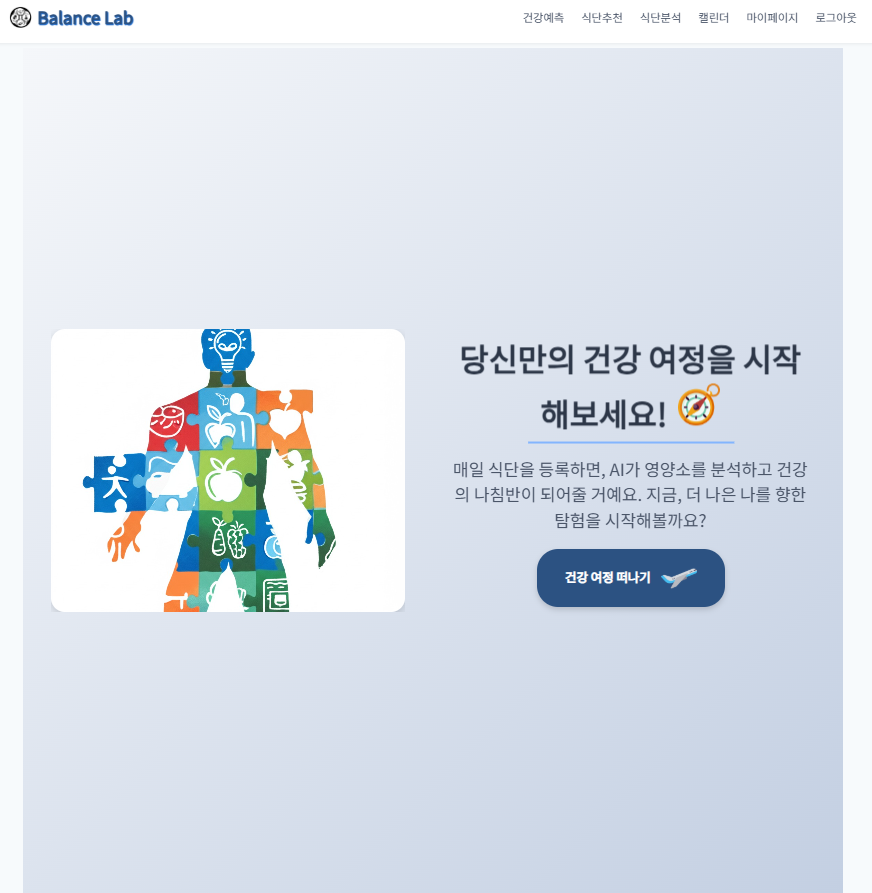
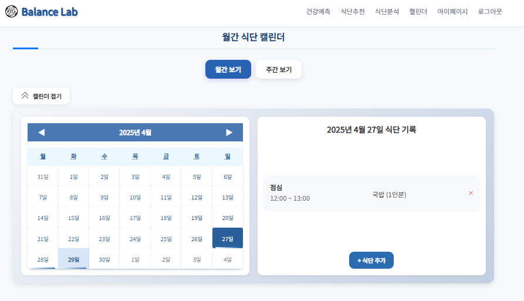

# BalanceLab FE

AI 기반 식단 분석 및 건강 예측 웹서비스의 프론트엔드입니다.  
React를 기반으로 구현되었으며, 사용자 식단 등록, 분석 결과 시각화, 캘린더 관리 등의 기능을 제공합니다.
---

## 시연영상(url)
- [BalanceLab 시연영상(유튜브링크)](유튜브주소)  

---

##  사용 기술

- React (Create React App)
- JavaScript (ES6)
- CSS Module
- Axios
- React Router
- Chart.js

---

##  프로젝트 실행 방법

### 1. 프로젝트 클론

```bash
git clone https://github.com/hsm9361/balancelabFE.git
cd balancelabFE
```

### 2. 의존성 설치

```bash
npm install
```

### 3. 환경 변수 파일 생성

`.env` 파일을 생성하고 아래와 같은 환경변수를 설정합니다:

```env
REACT_APP_API_URL=http://localhost:8080
```


### 4. 개발 서버 실행

```bash
npm start
```

브라우저에서 `http://localhost:3000`으로 접속하면 됩니다.

---

##  프로젝트 구조

```bash
balancelabFE/
├── public/
├── src/
│   ├── assets/                # 이미지, CSS 등 정적 리소스
│   ├── components/            # 공통 컴포넌트
│   ├── pages/                 # 라우팅 페이지 컴포넌트
│   ├── App.js
│   └── index.js
├── .env                      # 환경 변수 (개인 설정)
├── package.json              # 프로젝트 설정 및 스크립트
└── README.md
```

---

##  주요 기능

- 이미지 기반 식단 분석
- 일간/주간 캘린더에서 섭취 내역 확인
- 건강 예측 모델 결과 시각화
- 마이페이지에서 사용자 통계 확인

---

##  관련 저장소

- [BalanceLab BE (백엔드)](https://github.com/hsm9361/balancelabBE)  
- [BalanceLab ML (머신러닝 모델)](https://github.com/hsm9361/balancelabML)

---

## 📸 스크린샷


메인페이지




캘린더
 - 사용자가 식단을 등록했던 날들이 달력에 표시될 수 있도록 구현
 - 월간캘린더 조회 기능 구현


자연어 식단분석 페이지
- 사용자가 자연어로 먹은 식단을 입력하면 식단을 분석하여 각 영양소와 부족한 영양소를 알려주고 다음 식단을 제안
    - geminiAPI를 이용하여 자연어에서 음식이름만 추출 후 식단을 분석하는 FastAPI 구현하여 백엔드와 연결
    - React를 이용하여 프론트엔드 구현
    - html2canvas와 jspdf를 이용하여 PDF저장 기능 구현
    - 분석한 식단을 그대로 등록할 수 있는 기능 구현


챌린지 페이지
  - 사용자가 입력해둔 체중 정보를 DB에서 가져온 후 사용자가 새로 입력한 목표 체중과 비교하여 감소, 증가로 구분하여 챌린지가 시작


챌린지 페이지
  - 진행중인 챌린지가 있을 시 아래에 몸무게 변화 차트를 보여주는 기능 구현
  - 사용자가 입력한 챌린지 기간에 도달하거나 목표했던 체중에 도달하면 완료처리
  - 중단 클릭 시 챌린지가 완료되기 전 중단 처리
  - 사용자의 챌린지 기록들을 보여주는 기능 구현


MyBalance
 - 사용자의 최근 7일 영양소를 수치로 보여주는 기능
 - 주간 영양소 섭취를 차트로 보여주는 기능
